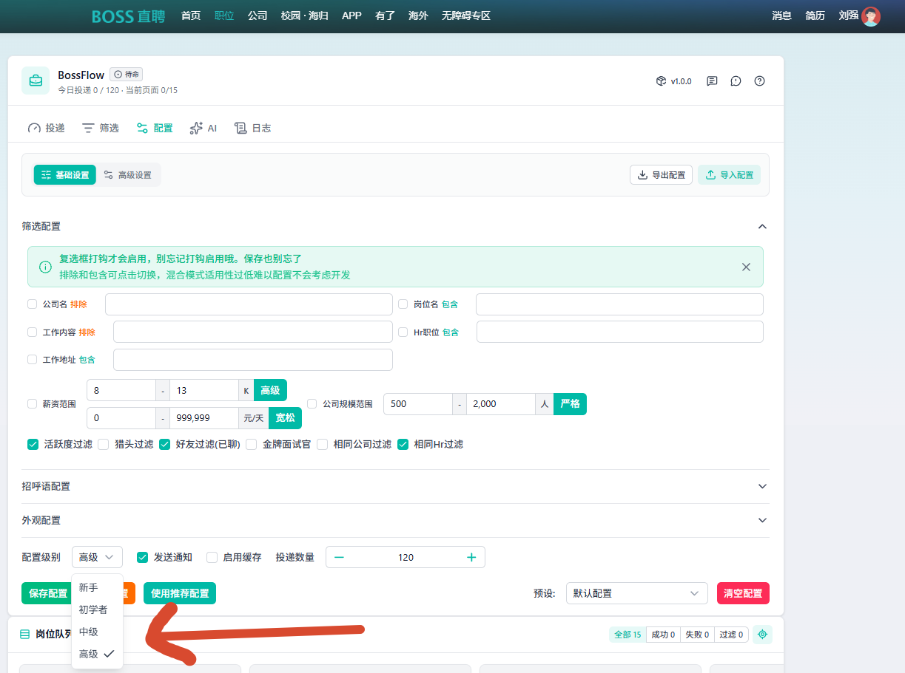
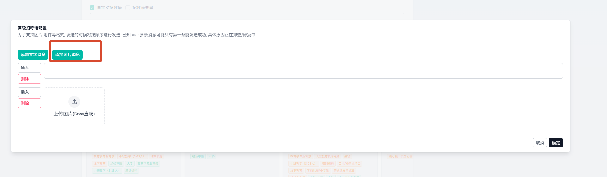
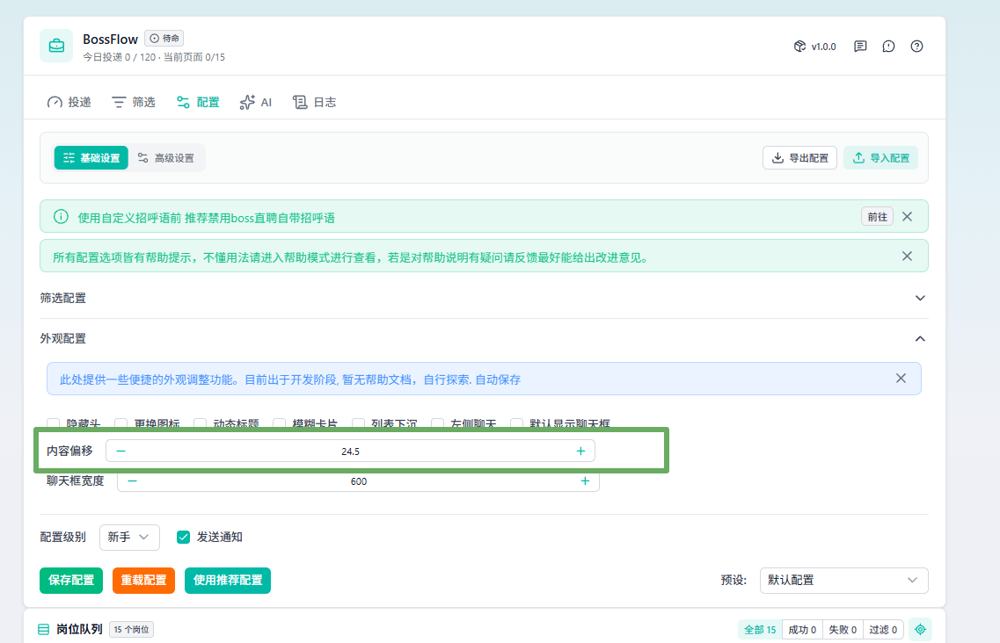

# BossFlow

BossFlow 帮你把 BOSS 直聘上的海投变成一个可控、可追踪的流程：从按条件圈定合适的岗位，到自动打招呼、实时看到每一个岗位的处理进度和投递结果，中途出错还能单独重试。它不替你做决定，而是把重复劳动接管掉，让你把时间花在准备面试上。

## 为什么有这个 Fork

本项目源自 [Ocyss/boss-helper](https://github.com/Ocyss/boss-helper)，是非官方社区维护 Fork，与 BOSS 直聘官方无关。

发起这个社区版本的原因很直接：上游项目近期维护节奏放缓，不少已知问题长时间没有得到处理。而我自己每天都在用这个插件投简历，等不起——所以我决定基于上游代码维护一个**持续跟进、及时修 bug** 的版本，修复的问题会直接更新到这里，我自己既是维护者也是第一个用户。

如果你也遇到上游未解决的问题，欢迎来 [Issues](https://github.com/Lqqqqqq123123/BossFlow/issues) 反馈，实际使用中暴露的问题会被优先处理。

## 项目状态

- 当前社区版本：`1.0.0`
- 社区仓库：<https://github.com/Lqqqqqq123123/BossFlow>
- 问题反馈：<https://github.com/Lqqqqqq123123/BossFlow/issues>
- 上游项目：<https://github.com/Ocyss/boss-helper>
- 构建目标：Chrome、Edge、Firefox

> [!WARNING]
> 自动化操作可能触发平台风控，包括限制功能、降低账号权重或封禁账号。请合理设置投递频率和数量，使用者自行承担相关风险。

## 主要能力

- 按岗位名称、公司、薪资、活跃度、地址等条件筛选岗位。
- 自动投递并展示今日处理、成功、过滤和重复数据。
- 支持自定义文本、图片招呼语及 AI 辅助筛选和招呼语。
- 支持配置预设、JSON 导入与导出。
- 展示岗位执行状态、任务时间线，并支持失败岗位重试。
- 配置数据、API Key 等敏感信息默认保存在浏览器扩展本地存储中。

## 使用方法

我最推荐的使用方法，就是一段自我介绍 + 一个图片简历，这是效率最高，也是最合理的方式，我自己也是这样子去投递的，首先，我们把配置级别选择到高级，如图：



然后，选择打招呼配置，点击高级打招呼配置，之后，就可以插入一个图片信息：



到这里，最重要的配置已经结束了，其他配置（比如基于公司名、薪资等过滤）很简单，大家自行探索吧。

## 获取与安装

### 为什么暂时没有插件商店版本

由于近期处于快速迭代和优化阶段，功能与修复更新频繁，暂时没有上架 Chrome / Edge / Firefox 应用商店。上架前还需要完成独立的商店开发者身份配置，目前社区版统一通过 GitHub Release 和本地构建分发。

商店版本上线后会在这里第一时间更新，敬请期待。

### 从 Release 直接下载插件压缩包（当前推荐）⭐⭐⭐

当前 V1.0 版本链接为：https://github.com/Lqqqqqq123123/BossFlow/releases/tag/v1.0.0 。下完完压缩包并解压后，在浏览器的插件界面（以 Google 为例子），会有一个加载未打包的插件，点击这里，选择刚刚解压好的文件夹就好，之后，就可以开始愉快的投递简历了。


### 本地构建并安装

从头构建只需四步：装 nvm → 装 Node → 克隆构建 → 导入浏览器。

**1. 安装 nvm 并下载 Node.js**

扩展构建需要 Node.js 22 或更高版本。推荐用 [nvm](https://github.com/nvm-sh/nvm) 管理 Node 版本（Windows 用户请使用 [nvm-windows](https://github.com/coreybutler/nvm-windows)）：

```powershell
# 安装 nvm 后，安装并启用 Node 22
nvm install 22
nvm use 22

# 确认版本
node -v
```

**2. 克隆仓库并安装依赖**

```powershell
git clone https://github.com/Lqqqqqq123123/BossFlow.git
cd BossFlow

# 启用 pnpm（Node 22 自带 corepack）
corepack enable
corepack prepare pnpm@latest --activate

pnpm install
```

**3. 构建扩展**

```powershell
# 一次构建 Chrome、Edge、Firefox 三端
pnpm build
```

构建产物位于：

```text
.output/chrome-mv3
.output/edge-mv3
.output/firefox-mv2
```

**4. 在浏览器中加载扩展**

- **Chrome / Edge**：打开扩展管理页（地址栏输入 `chrome://extensions` 或 `edge://extensions`）→ 开启右上角「开发者模式」→ 点击「加载已解压的扩展程序」→ 选择 `.output/chrome-mv3`（或 `.output/edge-mv3`）目录。
- **Firefox**：打开 `about:debugging#/runtime/this-firefox` → 点击「临时载入附加组件」→ 选择 `.output/firefox-mv2` 目录中的任意文件（如 `manifest.json`）。注意 Firefox 的临时加载在浏览器重启后会失效，需要重新载入。

加载完成后，打开 [BOSS 直聘](https://www.zhipin.com/) 的岗位列表页即可看到扩展界面，前往「配置」页设置筛选条件和招呼语后开始使用。

### 开发与质量检查

```powershell
pnpm dev      # 开发模式（热更新）
pnpm check    # 类型检查
pnpm lint     # 代码风格检查
pnpm test     # 运行测试
```

## 使用说明

1. 在 BOSS 直聘岗位列表页加载扩展。
2. 在“配置”页设置筛选条件、投递上限和招呼语，并保存配置。
3. 回到“投递”页开始任务，观察岗位队列和执行状态。
4. 导入配置后需要手动点击“保存配置”。配置文件可能包含隐私信息，请勿公开分享未经检查的文件。

## 已知问题 ⭐⭐⭐

### 宽屏下面板与页面错位 🚀

部分用户（尤其是较宽的显示器/窗口）会遇到 BossFlow 面板与下方 BOSS 页面内容没有对齐的情况。原因是插件的「内容偏移」配置中，默认值 `25` 是一个特殊值，表示完全关闭偏移补偿；此时在超宽视口下，插件插入的面板可能扰乱 BOSS 页面自身的布局，导致整体错位。

**解决办法**：打开「配置」页 → 「外观配置」→ 「内容偏移」，把数值从默认的 `25` 稍微调开（例如 `24.5` 或 `24`），面板与页面会自动重新对齐。该设置会持久保存，只需调整一次。任何非 `25` 的值都会启用偏移补偿机制。

如图：调整完后，就会对齐。



### 岗位队列卡片横向“错位”

「岗位队列」中的卡片条支持横向滚动：自动投递运行时，当前正在处理的岗位卡片会自动滚动居中，因此左侧可能露出半张被裁切的卡片，这是设计行为而非布局问题。将鼠标悬停在卡片条上滚动滚轮，可以手动横向浏览。

## 社区维护说明

- 社区版本保留上游完整 Git 历史、MIT License 和原作者版权声明。
- Fork 标识是 GitHub 正常展示上游关系的方式，不影响独立维护和发布。
- 上游作者不负责社区版本的功能、发布、支持或安全问题，请在社区仓库反馈。
- 独立商店身份完成前，仅以 GitHub Release 作为社区版发布入口。

## 许可与使用口径

代码仓库保留上游的 [MIT License](./LICENSE)，包括原作者版权声明。MIT License 允许复制、修改、分发和商业使用，但必须保留许可与版权声明。

上游 README 曾同时声明“禁止商业用途”，该表述与 MIT License 的商业使用授权存在冲突。社区版本当前按免费、非商业、学习交流用途维护；在完成正式法律口径确认前，不额外收窄或改写 MIT License 的授权内容。

## 贡献

1. 从社区仓库创建分支。
2. 完成修改并运行 `pnpm check`、`pnpm lint`、`pnpm test` 和 `pnpm build`。
3. Git 提交说明使用中文，可以保留 `fix:`、`feat:`、`docs:` 等类型前缀。
4. 向社区仓库提交 Pull Request。

## 致谢

感谢 [Ocyss/boss-helper](https://github.com/Ocyss/boss-helper) 原作者及所有历史贡献者。社区维护不会删除或替换原作者版权和贡献记录。
